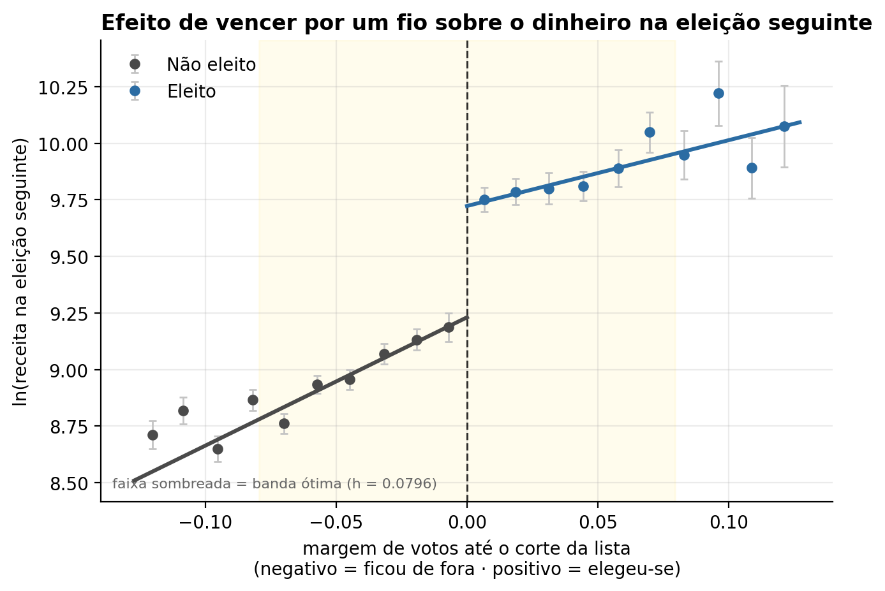

# Financiamento de campanha e retorno eleitoral

**Ganhar uma eleição, por si só, faz um candidato captar mais dinheiro na
eleição seguinte?** Este projeto responde com dados públicos do TSE e um
desenho de identificação causal, não com correlação.

A pergunta parece invertida de propósito — e é. A pergunta que todo mundo
faz é a outra: "quem gasta mais se elege mais?". Só que ela é quase
impossível de responder honestamente, porque candidatos com mais chance
de vencer também atraem mais doação. Gasto e chance de vitória se
determinam mutuamente, e correlacionar os dois mede as duas coisas
misturadas.

Este projeto vira a pergunta do avesso e mede o pedaço que **é**
identificável — que por acaso é justamente o mecanismo que torna a
correlação enganosa.

> ⚠️ **Status:** pipeline completo, validado ponta a ponta contra dados
> sintéticos com efeito causal conhecido. A execução sobre os dados reais
> do TSE ainda não foi feita, e **nenhum resultado sobre eleições reais é
> reportado aqui**. Ver [Estado atual](#estado-atual).

---

## Por que correlação não basta

Imagine dois vereadores. Um gastou R$ 80 mil e se elegeu; o outro gastou
R$ 8 mil e não se elegeu. É tentador concluir que o dinheiro elegeu o
primeiro.

Mas quem decide doar não sorteia o destinatário. Doadores procuram
candidatos que já parecem competitivos: o gasto alto pode ser
**consequência** da competitividade, não a causa dela. Os dois efeitos
produzem exatamente a mesma correlação nos dados, e nenhuma regressão de
votos contra gasto consegue separá-los — porque a variável que causa os
dois (reputação, articulação, viabilidade) não está na tabela.

A saída é achar uma situação em que o resultado tenha sido quase
sorteado. É o que uma disputa decidida por uma dúzia de votos oferece:
entre o último eleito e o primeiro suplente da mesma lista, quem ficou de
cada lado da linha é praticamente arbitrário — mesma qualidade, mesmo
gasto, mesma reputação — mas só um leva o mandato.

Comparar o que acontece com esses dois isola o efeito do mandato de tudo
o mais. É isso que faz uma **regressão descontínua**.

## O gráfico central



Cada ponto é a média de um grupo de candidatos com margem parecida. À
esquerda do tracejado, quem ficou de fora; à direita, quem se elegeu. Se
vencer não tivesse efeito nenhum, as duas linhas se encontrariam no
corte. O tamanho do degrau é a estimativa causal.

*(Figura gerada com dados sintéticos — ver [Estado atual](#estado-atual).)*

---

## O que o projeto faz

```
CSVs do TSE  ──▶  DuckDB  ──▶  variável de corte  ──▶  RDD  ──▶  figuras
  (Python)        (SQL)      (SQL, window fns)     (Python)
```

1. Monta um banco relacional (DuckDB) com candidaturas, votação, receitas
   e despesas de campanha, deflacionadas pelo IPCA.
2. Camada descritiva: gasto total, composição da receita (Fundo
   Eleitoral, doação de pessoa física, recursos próprios), concentração
   do gasto por decil, gasto por voto.
3. Calcula, **dentro de cada lista partidária**, a margem de votos entre
   o último eleito e o primeiro suplente — a linha de corte do desenho.
4. Liga a mesma pessoa entre duas eleições, por hash de CPF quando
   existe e por cascata de nome quando não existe.
5. Estima o salto no corte com `rdrobust` e roda a bateria completa de
   robustez.
6. Aplica **regras de decisão fixadas antes da execução** e emite um
   veredito: identificado, condicional ou não identificado.

**A escolha de linguagem é por problema, não por hábito.** SQL faz o
trabalho relacional — junções entre candidatos, receitas, despesas e
resultados, e as *window functions* que constroem a margem dentro de cada
lista. Python faz ingestão, econometria e visualização, e nunca varre
linha de despesa em loop.

O arquivo que vale ler primeiro é
[`sql/02_calculo_margem_disputa.sql`](sql/02_calculo_margem_disputa.sql):
é onde a variável de corte é construída, e onde está a diferença entre um
RDD válido e um que parece válido.

## Como rodar

```bash
git clone https://github.com/PedroVeit/financiamento-eleitoral-rs
cd financiamento-eleitoral-rs
pip install -r requirements.txt

make demo     # pipeline inteiro em dados sintéticos, ~1 min, sem download
make test     # 44 testes, incluindo recuperação de um efeito conhecido
```

Com dados reais do TSE (o download é pesado):

```bash
make inspecionar ANOS="2024"     # imprime os cabeçalhos dos CSVs do ano
make dados  ANOS="2020 2024"     # baixa e extrai só os CSVs do RS
make banco  ANOS="2020 2024"     # popula o DuckDB e valida os totais
make painel DE=2020 PARA=2024    # liga a mesma pessoa entre as eleições
make analise                     # descritiva + RDD + robustez + figuras
```

Tudo em `outputs/` é reproduzível do zero com esses comandos. `data/` não
vai para o repositório.

## Validação: o pipeline recupera um efeito conhecido?

O repositório inclui um gerador de dados sintéticos que escreve CSVs no
**formato do TSE** a partir de um processo com efeito causal conhecido
(τ = 0,55) — incluindo de propósito a variável de qualidade omitida que
enviesa a regressão ingênua. Como a saída é CSV, o caminho de ingestão
inteiro é exercitado, não uma maquete dele.

```
=== 3. estimativas de RDD ===
      concorreu_t1 | tau = +0.0814 (ep 0.0379) | p = 0.0180   <- margem extensiva
ln_receita_t1_cond | tau = +0.4920 (ep 0.0808) | p = 0.0000   <- τ verdadeiro = 0,55 ✓
         eleito_t1 | tau = +0.0491 (ep 0.0305) | p = 0.2163

=== 4. robustez ===
  densidade no corte: p = 0.790            <- não rejeita continuidade
  varredura de janelas: τ entre 0,39 e 0,56 em 7 janelas
  cortes placebo: nenhum significante

=== 6. leitura do resultado (regras fixadas antes da execução) ===
veredito: CONDICIONAL
  motivo: ser eleito muda a probabilidade de voltar a concorrer
          (τ = +0.0814, p = 0.0180). O desfecho de receita só é observado
          para quem voltou, então o efeito é CONDICIONAL a recandidatar-se.
```

Repare no último bloco: o simulador planta **de propósito** uma seleção
(quem se elege se recandidata mais), e o pipeline detecta sozinho que
isso torna o efeito principal condicional. A regra que produz esse
veredito está escrita em `python/analysis/regras_decisao.py` e foi fixada
antes de qualquer execução.

Isso já pegou um bug real: o `log()` do DuckDB é logaritmo de **base 10**,
não natural, e todos os coeficientes saíam divididos por 2,3 — com
aparência inteiramente plausível. Um resultado plausível e errado é pior
que um obviamente quebrado, porque não convida a verificação.

## O que este projeto NÃO conclui

- **Não mede o efeito do dinheiro sobre votos.** Mede o efeito de vencer
  sobre o dinheiro captado depois. São perguntas diferentes, e a primeira
  exigiria outro desenho — ver
  [nota metodológica](docs/nota_metodologica_rdd.md), seções 2 e 11.
- **Não avalia partidos.** Toda métrica é aplicada de forma idêntica a
  todos os partidos, os filtros são estruturais (ano, cargo, UF, situação
  de candidatura) e nenhum gráfico usa cor por partido. Composição de
  receita não mede mérito.
- **Não generaliza para disputas folgadas.** O efeito vale para quem
  ganhou ou perdeu no fio, em Rio Grande do Sul, para vereador.
- **Não enxerga caixa dois.** O dado é o que foi declarado à Justiça
  Eleitoral.
- **Não trata resultado nulo como fracasso.** Se a robustez não sustentar
  um efeito, isso é reportado como tal.
- **Não tem vínculo institucional.** Projeto pessoal, dados públicos.

## Estrutura

```
sql/
  schema.sql                     modelo relacional + deflator + painel
  01_agregacoes_receita.sql      receitas, despesas, composição, deflação
  02_calculo_margem_disputa.sql  variável de corte intra-lista (o núcleo)
  03_janela_rdd.sql              amostra do RDD e painel t → t+1
python/
  ingest/    download_tse.py, load_to_duckdb.py, deflator.py
  synthetic/ gerar_dados_sinteticos.py     CSVs no formato do TSE
  analysis/  build_panel.py, rdd_model.py, descriptive.py, regras_decisao.py
  viz/       plots.py
  run_pipeline.py                orquestra tudo
docs/
  nota_metodologica_rdd.md       o que o desenho identifica e o que não
  plano_execucao.md              o que falta, em ordem
  dicionario_dados.md            tabelas, views e colunas
  decisoes.md                    decisões de projeto, com a razão de cada uma
tests/                           44 testes de integridade e de recuperação do efeito
```

## Notas sobre os dados

- **Pseudonimização.** CPFs e CNPJs de candidatos, doadores e fornecedores
  entram no banco apenas como SHA-256 com sal. O sal vem de
  `FIN_HASH_SAL` e não é versionado — sem sal, o hash de um CPF é
  reversível por força bruta, já que o espaço de CPFs válidos é pequeno.
- **Valores nominais no banco, reais na análise.** A deflação pelo IPCA
  acontece na camada analítica, para que o dado bruto continue auditável
  contra os totais publicados pelo TSE.
- **Nomes de coluna mudam entre eleições.** O carregador declara
  alternativas por conceito e usa a primeira que existir;
  `make inspecionar` imprime os cabeçalhos de um ano novo.

## Estado atual

| Etapa | Situação |
|---|---|
| Schema, camada SQL e deflator | pronto |
| Ingestão do TSE | escrita, **não testada contra o servidor real** |
| Pareamento do painel entre eleições | pronto |
| Modelo causal + bateria de robustez | pronto |
| Regras de decisão pré-registradas | prontas e automatizadas |
| Validação em dados sintéticos | pronta, 44 testes passando |
| Execução em dados reais | **pendente** |
| Desenho B (efeito do gasto sobre voto) | ver nota metodológica, seção 11 |

O código de download foi escrito a partir da estrutura conhecida do
Repositório de Dados Eleitorais, mas o TSE altera nomes de arquivo e de
coluna entre eleições. Espere ajustar `FONTES` em `download_tse.py` e
`COLMAP` em `load_to_duckdb.py` na primeira execução — é manutenção
esperada, não sinal de erro. Ver [`docs/plano_execucao.md`](docs/plano_execucao.md).

## Fontes

Portal de Dados Abertos do TSE (`dadosabertos.tse.jus.br`), conjuntos
*Candidatos*, *Resultados* e *Prestação de Contas Eleitorais*, licença
Creative Commons Atribuição. IPCA: IBGE/SIDRA.

---

Projeto pessoal, com dados públicos, sem vínculo institucional e sem
juízo sobre partidos ou candidatos específicos. O objeto de estudo é o
mecanismo de financiamento, não os atores.

**Autor:** Pedro ([@PedroVeit](https://github.com/PedroVeit)) · Licença MIT
